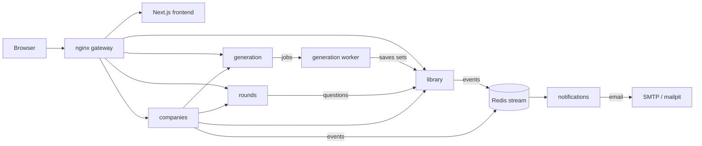

# prepza.

Turn a job description or a learning goal into a structured practice path: reviewed topics, a bank of questions with reference answers, graded practice rounds, and certificates for topics you have fully covered. Companies can use the same engine to generate interviews and invite candidates.

## Features

**For learners**

- Paste a job description or describe a goal; the AI extracts the requirements and proposes topics.
- Review the topics before anything expensive runs: uncheck what you don't need, or describe changes in plain text.
- Every topic gets a question bank. Each question has a reference answer and multiple-choice options.
- Practice in **multiple choice** or **open answer** rounds. Open answers are graded by an LLM against the reference, with feedback, and you can ask follow-up questions about any answer.
- Rounds show unanswered questions first, then your weakest ones.
- A **certificate** for a topic requires answering every question of the topic in open-answer rounds, with an average of 70% or more. A topic with a certificate counts as *mastered*.
- Rate preparations, like or dislike questions, and report problems. Owners can re-generate individual questions.
- Share a preparation privately by email, or publish it to the public library.

**For companies**

- Generate an interview from a job description and set how many questions each topic asks.
- Invite candidates by email. Each candidate gets a random subset of each topic, in a single pass.
- Scorecards show every answer and grade; you choose whether candidates see their scores.

## Architecture



| Service | Responsibility |
|---|---|
| `library` | Preparations and interviews (question sets), sharing, joining, ratings and reports, public library search |
| `generation` | The generation pipeline (LangGraph) run by an arq worker, topic review, re-generating single questions |
| `rounds` | Practice rounds, LLM grading and follow-up chat, certificates, candidate interview sessions |
| `companies` | Companies, admins, interviews and candidate invites |
| `notifications` | Consumes domain events from a Redis stream and sends emails |
| `frontend` | Next.js app; server-rendered pages call the API through the gateway |

Each service owns its own Postgres database. Services call each other's `/internal/` endpoints with short-lived signed tokens; the gateway never exposes those routes. Users sign in with Firebase Authentication (the local setup uses the Firebase emulator, so no Firebase project is needed).

### Generation pipeline

```
job text -> extract requirements and level -> (look up the company) -> draft topics
         -> human review loop -> questions per subtopic, in parallel -> dedupe per topic
         -> answers and multiple-choice options, in parallel batches -> save to the library
```

The graph is checkpointed in Postgres, so a failed run can be retried from where it stopped. Token usage and cost are recorded per generation and shown while it runs.

## Running locally

Requirements: Docker with Compose, an OpenAI API key, and a Tavily API key (used to look up a company's description when the job text doesn't include one).

```bash
cp .env.example .env
# Set OPENAI_API_KEY and TAVILY_API_KEY in .env.
docker compose up --build
```

| URL | What |
|---|---|
| http://localhost:8090 | The app |
| http://localhost:4100 | Firebase Auth emulator UI (sign-in creates fake accounts here) |
| http://localhost:8125 | Mailpit: every email sent locally |

`docker-compose.override.yml` is loaded automatically in development. It mounts the source and reloads on change, and it is the only place the Firebase emulator is enabled.

### Cost

Most of the cost is writing a reference answer and options for every question. Two settings in `.env` control it:

- `QUESTIONS_PER_TOPIC` (default 20): questions generated per topic.
- `LLM_MODEL` (default `gpt-4o`): used for generation, grading and chat. A mini model is much cheaper; check the quality on your own topics first.

The generation page shows the AI cost so far. Per-user rate limits (`GENERATION_LIMIT`, `LLM_LIMIT`) cap how much a single account can spend.

## Tests

```bash
# Each Python service
cd services/rounds && uv sync && uv run pytest

# Frontend
cd frontend && pnpm install && pnpm lint && pnpm typecheck

# Smoke test against a running stack
./scripts/smoke.sh
```

CI runs all of these on every push and pull request.

## Project conventions

See [CLAUDE.md](CLAUDE.md): separate modules for schemas, models, prompts, helpers and constants; `app/main.py` only wires the app; at most 300 lines per file; and the simplest solution that works.

## Roadmap

[docs/improvement-plan.md](docs/improvement-plan.md) lists the known issues and the planned work: reusing high-quality questions across preparations, using ratings and reports to improve quality automatically, and reducing the cost of each generation.
