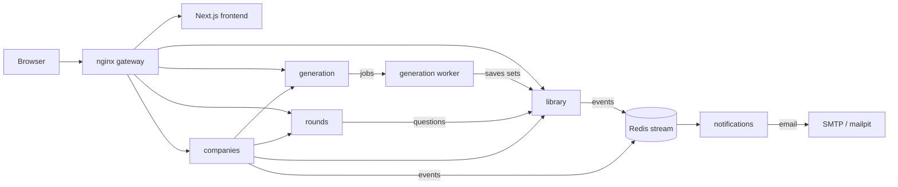

# prepza.

Turn a job description or a learning goal into a structured practice path: reviewed topics, a bank of multiple-choice questions, practice rounds, and certificates for topics you have fully covered. Companies can use the same engine to generate interviews and invite candidates.


## Features

**For learners**

- Paste a job description or describe a goal; the AI extracts the requirements and proposes topics.
- Review the topics before anything expensive runs: uncheck what you don't need, or describe changes in plain text.
- Every topic gets a bank of multiple-choice questions, each with one correct option and three plausible wrong ones.
- Practice in rounds. After each answer you see the correct option, and you can ask an AI tutor follow-up questions about it.
- Rounds show unanswered questions first, then your weakest ones.
- Each topic shows a progress bar towards its **certificate**: answer every question of the topic (your latest answer to each counts), with at least 70% correct. A topic with a certificate counts as *mastered*.
- Rate preparations, like or dislike questions, and report problems. Owners can re-generate individual questions.
- Share a preparation privately by email, or publish it to the public library.

**For companies**

- Generate an interview from a job description and set how many questions each topic asks.
- Invite candidates by email. Each candidate gets a random subset of each topic, in a single pass.
- Scorecards show every answer and whether it was right; you choose whether candidates see their scores.

## Architecture



| Service | Responsibility |
|---|---|
| `library` | Preparations and interviews (question sets), sharing, joining, ratings and reports, public library search |
| `generation` | The generation pipeline (LangGraph) run by an arq worker, topic review, re-generating single questions |
| `rounds` | Practice rounds, progress and certificates, the follow-up chat, candidate interview sessions |
| `companies` | Companies, admins, interviews and candidate invites |
| `notifications` | Consumes domain events from a Redis stream and sends emails |
| `frontend` | Next.js app; server-rendered pages call the API through the gateway |

Each service owns its own Postgres database. Services call each other's `/internal/` endpoints with short-lived signed tokens; the gateway never exposes those routes. Code the API services share (sign-in, service tokens, logging, database and HTTP setup) lives in [`packages/common`](packages/common), installed into each service from the repo; the API images are therefore built from the repo root. Users sign in with Firebase Authentication (the local setup uses the Firebase emulator, so no Firebase project is needed).

### Generation pipeline

```
job text -> extract requirements and level -> (look up the company) -> draft topics
         -> human review loop -> reuse proven questions from similar public topics
         -> questions per subtopic, in parallel -> dedupe per topic
         -> correct and wrong options, in parallel batches
         -> top up any topic short of its size -> save to the library
```

The graph is checkpointed in Postgres, so a failed run can be retried from where it stopped, and a generation can be cancelled at any step.

Similar topics are found with pgvector embeddings. Topics saved before embeddings existed get them from a one-off job: `docker-compose exec generation uv run --no-sync python -m app.jobs.backfill_embeddings`. Reused questions fill at most half of a topic, and only questions that have been answered and never flagged qualify. Questions are flagged from how they're answered, thumbs and reports. A background verifier then fixes the marked answer, writes new options or replaces the question. Its key checks go to OpenAI's Batch API every 10 minutes, at half price.

## Running locally

Requirements: Docker with Compose and an OpenAI API key.

```bash
cp .env.example .env
# Set OPENAI_API_KEY in .env.
docker compose up --build
```

| URL | What |
|---|---|
| http://localhost:8090 | The app |
| http://localhost:4100 | Firebase Auth emulator UI (sign-in creates fake accounts here) |
| http://localhost:8125 | Mailpit: every email sent locally |

Each API's database migrations run once in a short-lived `*-migrate` container before the API starts, and Docker marks an API healthy only when `/ready` confirms its database and Redis answer.

`docker-compose.yml` is for local development only. It builds each image's `dev` target, mounts the source so servers reload on change, and enables the Firebase emulator.

### Production images

Every app Dockerfile (on Alpine) has a `prod` target with the code built in and no reload. The API images are built from the repo root, because they include `packages/common`:

```bash
docker build --target prod -f services/library/Dockerfile -t prepza-library .   # also generation, rounds, companies
docker build --target prod -t prepza-notifications services/notifications
docker build --target prod -t prepza-frontend \
  --build-arg NEXT_PUBLIC_FIREBASE_API_KEY=... --build-arg NEXT_PUBLIC_FIREBASE_AUTH_DOMAIN=... \
  --build-arg NEXT_PUBLIC_FIREBASE_PROJECT_ID=... frontend
```

Run each API's migrations (`uv run --no-sync alembic upgrade head`) once before it starts, and never set `FIREBASE_AUTH_EMULATOR_HOST` in production.

### Generation settings

Two settings in `.env` shape every generation:

- `QUESTIONS_PER_TOPIC` (default 100): questions per topic. Topics never grow after generation, so a certificate always means the same set of questions.
- `LLM_REQUESTS_PER_SECOND` (default 8): generation's LLM requests a second, shared by the API and every worker through Redis; 0 turns it off. Chat isn't limited by it, so it stays responsive during big generations.
- `LLM_MODEL` (default `gpt-6-luna`): used for generation and the follow-up chat.

Per-user rate limits (`GENERATION_LIMIT`, `LLM_LIMIT`) cap how much a single account can generate and chat.

## Tests

```bash
# Each Python service
cd services/rounds && uv sync && uv run pytest

# Frontend
cd frontend && pnpm install && pnpm lint && pnpm typecheck
# After changing an API: regenerate the frontend's API types (needs the stack running)
cd frontend && pnpm api-types

# Smoke test against a running stack
./scripts/smoke.sh
```

CI runs all of these on every push and pull request.

## Project conventions

See [CLAUDE.md](CLAUDE.md): separate modules for schemas, models, prompts, helpers and constants; `app/main.py` only wires the app; at most 300 lines per file; and the simplest solution that works.
