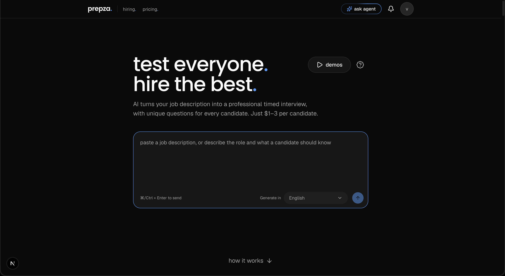
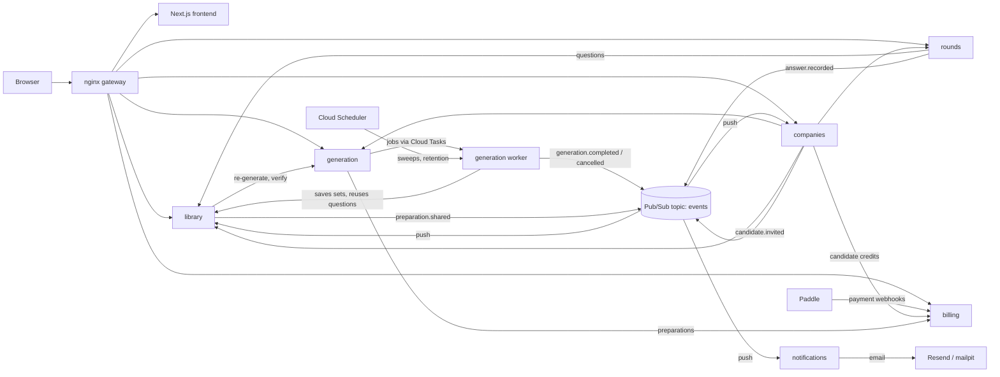

# prepza.

Turn a job description or a learning goal into a structured practice path: reviewed topics, a bank of multiple-choice questions, practice rounds, and certificates for topics you have fully covered. Companies can use the same engine to generate interviews and invite candidates.



## Features

**For learners**

- Paste a job description or describe a goal; the AI extracts the requirements and proposes topics.
- Review the topics before anything expensive runs: uncheck what you don't need, rename a topic or edit its subtopics in place, or describe bigger changes in plain text.
- Every topic gets a bank of multiple-choice questions, each with one correct option and three plausible wrong ones.
- Practice in rounds. After each answer you see the correct option, and you can ask an AI tutor follow-up questions about it.
- Rounds show unanswered questions first, then your weakest ones.
- Each topic shows a progress bar towards its **certificate**: answer every question of the topic (your latest answer to each counts), with at least 70% correct. A topic with a certificate counts as *mastered*.
- After answering, rate the question (thumbs up or down, changeable) or report a problem; rate preparations with stars. Owners can re-generate individual questions.
- Questions improve on their own: answers, votes and reports flag weak ones, and a background verifier fixes or replaces them (see [Question quality](#question-quality)).
- Share a preparation privately by email, or publish it to the public library.
- Every list loads more as you scroll and renders only what's on screen, however long it gets.

**For companies**

- Generate an interview from a job description and set how many questions each topic asks.
- Invite candidates by email, resend an invite, or revoke one the candidate hasn't used yet. The invite page tells candidates what to expect before they start.
- Each candidate gets a random subset of each topic, with their own question and option order, in a single pass. Answers can't be changed, and unanswered questions count as wrong.
- Make an interview **timed**: each question gets its own countdown (60 seconds by default), and a question still open when it reaches zero counts as wrong. The server enforces it, so closing the tab doesn't stop the clock.
- Scorecards show every answer, whether it was right and how long it took. They flag answers too fast to have read the question, times the candidate left the page, and copy attempts.
- You choose whether candidates see their scores.

## Architecture



| Service | Responsibility |
|---|---|
| `library` | Preparations and interviews (question sets), sharing, joining, ratings and reports, public library search, question quality flags and reuse |
| `generation` | The generation pipeline (LangGraph), run by its worker (`app/worker_main.py`) as Cloud Tasks jobs; topic review, re-generating single questions, the question verifier, and scheduled sweeps |
| `rounds` | Practice rounds, progress and certificates, the follow-up chat, candidate interview sessions |
| `companies` | Companies, admins, interviews and candidate invites |
| `billing` | Credits, the Job Search Pass, free allowances and Paddle payments (webhooks); other services ask it before a paid action |
| `notifications` | Receives domain events pushed by Pub/Sub and sends emails through Resend (mailpit without a key) |
| `frontend` | Next.js app; server-rendered pages call the API through the gateway |

Each service owns its own Postgres database. Services call each other's `/internal/` endpoints with short-lived signed tokens; the gateway never exposes those routes. Code the API services share (sign-in, service tokens, logging, database and HTTP setup) lives in [`packages/common`](packages/common), installed into each service from the repo; the API images are therefore built from the repo root. Every list endpoint takes `offset` and `limit` (at most 100 per page). Users sign in with Firebase Authentication (the local setup uses the Firebase emulator, so no Firebase project is needed). Long jobs (a generation, a question check) are Cloud Tasks that call the generation worker's `/internal/jobs/...`; periodic work (stuck-generation sweeps, key-check batches, retention) is Cloud Scheduler calling `/internal/schedules/...`. Google signs those calls, and pushes, as one invoker service account, which each service checks. Locally there is no queue: the API calls the worker directly, and a small `scheduler` container runs `scripts/crontab`. Domain events are saved in an `outbox` table in the same transaction as the change they announce, published right after, and published by a per-minute scheduled flush if that failed, so a change never loses its event. They go to one Pub/Sub topic, `events`, which pushes each event to the `/internal/events` endpoint of library, companies and notifications; each ignores events that aren't its own. Locally, Google's Pub/Sub emulator runs in docker-compose and `scripts/pubsub-setup.sh` creates the topic and subscriptions.

### Generation pipeline

```
job text -> extract requirements and level -> draft topics          (both cached per input)
         -> human review loop (checkboxes, inline edits, or free-text revision)
         -> reuse proven questions from similar public topics      (pgvector)
         -> questions with their options, in parallel calls per subtopic
         -> drop duplicates by meaning                             (embeddings)
         -> top up any topic short of its size -> save to the library
```

The graph is checkpointed in Postgres, so a failed run can be retried from where it stopped, and a generation can be cancelled at any step.

Every LLM call of the pipeline shares one rate limit across the API and all workers (`LLM_REQUESTS_PER_SECOND`). Reused questions fill at most half of a topic, and only questions that have been answered and never flagged qualify. Topics saved before embeddings existed get them from a one-off job: `docker compose exec generation uv run --no-sync python -m app.jobs.backfill_embeddings`.

### Question quality

Rounds publish every answer; library keeps per-question stats (answers, correct, picks per option) next to thumbs and reports, and flags a question when they show a problem:

| Flag | When | What the verifier does |
|---|---|---|
| `wrong_key` | 2 "wrong answer" reports, or a wrong option picked more than the marked one (after 30 answers) | Checks the key through OpenAI's Batch API (half price, every 10 minutes): keeps the question, moves the key, or replaces it |
| `rewrite` | 2 "unclear" or "off topic" reports, 3+ dislikes at twice the likes, or ≤ 15% correct | Writes a new question in its place |
| `weak_options` | A wrong option almost nobody picks, or ≥ 95% correct | Writes new options for the same question |

Fixes happen in place, so a topic's size never changes, and the replaced version is archived with its stats and feedback. A replacement question must differ in meaning from every question already in the topic, checked by embeddings like the pipeline's duplicate step.

## Running locally

Requirements: Docker with Compose and an OpenAI API key.

```bash
cp .env.example .env
# Set OPENAI_API_KEY in .env.
docker compose up --build
```

| URL | What |
|---|---|
| http://localhost:8090 | The app |
| http://localhost:4100 | Firebase Auth emulator UI (sign-in creates fake accounts here) |
| http://localhost:8125 | Mailpit: every email sent locally, when `RESEND_API_KEY` is empty |

Without `RESEND_API_KEY`, emails go to Mailpit instead of real inboxes. See [Emails](#emails) to send real ones.

Each API's database migrations run once in a short-lived `*-migrate` container before the API starts, and Docker marks an API healthy only when `/ready` confirms its database and Redis answer.

`docker-compose.yml` is for local development only. It builds each image's `dev` target, mounts the source so servers reload on change, and enables the Firebase emulator. The frontend keeps its `node_modules` in a volume, so after a frontend dependency changes, run `docker compose build frontend`, remove the `prepza_frontend-modules` volume and start again.

### Google Cloud

Production runs on Google Cloud in `europe-west1`, set up by Terraform in [`infra/`](infra/README.md), which also has the one-time bootstrap steps.

### Production images

Every app Dockerfile (on Alpine) has a `prod` target with the code built in and no reload. The API images are built from the repo root, because they include `packages/common`:

```bash
docker build --target prod -f services/library/Dockerfile -t prepza-library .   # also generation, rounds, companies
docker build --target prod -t prepza-notifications services/notifications
docker build --target prod -t prepza-frontend \
  --build-arg NEXT_PUBLIC_FIREBASE_API_KEY=... --build-arg NEXT_PUBLIC_FIREBASE_AUTH_DOMAIN=... \
  --build-arg NEXT_PUBLIC_FIREBASE_PROJECT_ID=... frontend
```

Run each API's migrations (`uv run --no-sync alembic upgrade head`) once before it starts, and never set `FIREBASE_AUTH_EMULATOR_HOST` in production.

Errors go to Sentry when `SENTRY_DSN` (backend services) and `NEXT_PUBLIC_SENTRY_DSN` (frontend, a build argument) are set; empty, nothing is sent. Events carry user ids only, with emails scrubbed. To see the original code in frontend stack traces, also pass `SENTRY_AUTH_TOKEN`, `SENTRY_ORG` and `SENTRY_PROJECT` to the frontend build.

### Generation settings

Three settings in `.env` shape every generation:

- `QUESTIONS_PER_TOPIC` (default 100): questions per topic. Topics never grow after generation, so a certificate always means the same set of questions.
- `LLM_REQUESTS_PER_SECOND` (default 8): generation's LLM requests a second, shared by the API and every worker through Redis; 0 turns it off. Chat isn't limited by it, so it stays responsive during big generations.
- `LLM_MODEL` (default `gpt-6-luna`): used for generation and the follow-up chat.

Per-user rate limits (`GENERATION_LIMIT`, `LLM_LIMIT`) cap how much a single account can generate and chat.

### Payments

`billing` sells through [Paddle](https://www.paddle.com), which is the merchant of record (it handles VAT and sales tax). Companies buy candidate credits (the first 5 are free); learners get 1 free private preparation a month and can buy the Job Search Pass or 3 more preparations. To sell:

1. In Paddle (start with the sandbox), create a product and price for each item in `services/billing/app/constants/products.py`, and a client-side token.
2. Add a webhook destination for `transaction.completed` pointing at `https://<your domain>/api/billing/webhooks/paddle`.
3. Set `PADDLE_ENVIRONMENT`, `PADDLE_CLIENT_TOKEN`, `PADDLE_WEBHOOK_SECRET` and the `PADDLE_PRICE_*` ids in `.env`, then restart billing. Locally, Paddle reaches the webhook only through a tunnel (for example `cloudflared tunnel --url http://localhost:8090`).

### Emails

Share and candidate invites are sent by the `notifications` service, as HTML with a plain-text version. To send real emails through [Resend](https://resend.com):

1. Verify your domain at resend.com/domains.
2. In `.env`, set `RESEND_API_KEY` (a sending-only key is enough) and `MAIL_FROM` with an address on that domain, for example `prepza. <no-reply@yourdomain.com>`.
3. Restart the service: it reads `.env` only when it starts.

A failed send answers Pub/Sub's push with an error, so Pub/Sub retries it and, after the subscription's maximum attempts, moves it to the dead-letter topic; the error from Resend is in the logs. Retries never send an email twice.

To show invites whose email bounced or was marked as spam ("Email not delivered" in the candidates and share lists), add a webhook at resend.com/webhooks pointing at `https://<your domain>/api/notifications/webhooks/resend` with the events `email.bounced`, `email.complained` and `email.suppressed`. Put its signing secret (`whsec_...`) in `.env` as `RESEND_WEBHOOK_SECRET` and restart notifications. Without the secret every webhook is refused. Locally, Resend reaches it only through a tunnel, as with Paddle.

## Tests

Each Python service (and `packages/common`) keeps `tests/unit` (fakes, no services needed) and `tests/integration` (real Postgres and Redis), with the shared setup in `tests/conftest.py`.

```bash
# Unit tests of each Python service, and of the shared package (packages/common)
cd services/rounds && uv sync && uv run pytest

# Python lint and format, as CI runs them (ruff's version is pinned in CI)
uvx ruff@0.16.10 check services packages && uvx ruff@0.16.10 format --check services packages

# Frontend
cd frontend && pnpm install && pnpm lint && pnpm typecheck
# After changing an API: regenerate the frontend's API types (needs the stack running)
cd frontend && pnpm api-types

# Smoke test against a running stack
./scripts/smoke.sh

# Integration tests: each service's tests/integration against the running stack's real Postgres
# and Redis, in a "<service>_test" database created and dropped for the run
./scripts/integration.sh            # or: ./scripts/integration.sh rounds library
```

CI runs all of these on every push and pull request, and also builds every production image and starts the whole stack for the smoke test.

## Project conventions

See [CLAUDE.md](CLAUDE.md): separate modules for schemas, models, prompts, helpers and constants; `app/main.py` only wires the app; at most 300 lines per file; the simplest solution that works; and no business logic on the frontend (rules, thresholds and decisions live in the services).
