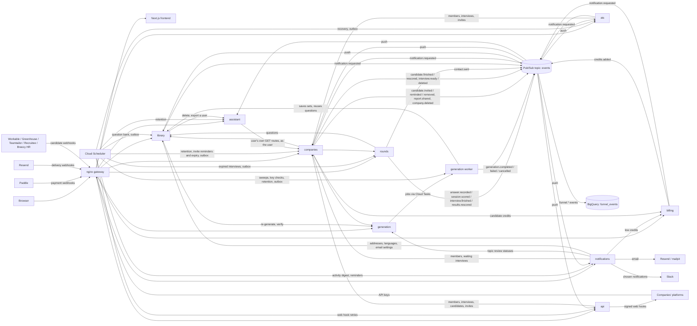

# Architecture

prepza is a set of Python API services behind an nginx gateway, with a Next.js frontend. They talk through signed internal calls and through events on one Pub/Sub topic.

- [Overview](#overview)
- [Services](#services)
- [How services work together](#how-services-work-together)
- [Background work](#background-work)
- [Events](#events)
- [Funnel events](#funnel-events)

## Overview

## Services

| Service | Responsibility |
|---|---|
| `library` | Question sets (topics and questions) of interviews and templates: the template catalog, the question bank's stages, revealed questions for practice; candidates' votes and reports, question quality flags and reuse; users' email preferences and their consent log; also account deletion and export across services |
| `generation` | The generation pipeline (LangGraph), run by its worker (`app/worker_main.py`) as Cloud Tasks jobs; topic review, re-generating single questions, the question verifier, and scheduled sweeps |
| `rounds` | Candidates' interview sessions and their answers, free practice rounds; the FAQ, the help chat (and the same knowledge as text at `/help/guide`, for the assistant), the legal texts and the contact form (`/help/...`) |
| `companies` | Companies (unique names, logos, verification), members (owner, admins, viewers), interviews, candidate invites (one by one, in bulk, through a shareable link, with reminders), reports |
| `billing` | Companies' credit wallets (holds and charges), welcome credits, referrals, Paddle top-ups, automatic top-ups, refunds and chargebacks (webhooks); companies sets a candidate's credits aside and charges them through it |
| `notifications` | Receives domain events pushed by Pub/Sub and sends emails through Resend (mailpit without a key): candidate invites and reminders, emailed PDF reports, contact messages to prepza's inbox, and to company members the daily activity digest, reminders (low credits, interviews nobody was invited to, topics waiting for review) and failed automatic top-ups. Also the bell: stores the notifications other services ask for (`notification.requested`), removes a deleted company's (`company.deleted`), and streams them live to open tabs over server-sent events, through Redis pub/sub so every instance hears them (one subscription per instance, shared by its open tabs). Posts a company's chosen notifications to its Slack channel too, through the channel's incoming web hook. Signs emails' unsubscribe links and applies them (`/unsubscribe/{token}`, no sign-in): a user's email settings in library, a candidate's opt-out from a company's emails in its own database, checked before each invite and reminder |
| `ats` | ATS integrations (Workable, Greenhouse, Teamtailor, Recruitee, Breezy HR): companies' encrypted ATS keys, linked jobs and the candidates the ATSs send (their webhooks); invites them through companies and writes their results back to the ATS |
| `api` | The public API at `/api/v1/`: companies' API keys (as hashes, with their expiry), their web hooks (secrets encrypted) and deliveries; reads interviews and candidates and invites through companies, and sends a signed web hook when a candidate finishes |
| `assistant` | The in-app AI assistant ([feature page](features/assistant.md)): signed-in users' conversations, streamed over server-sent events (`POST /chat`), and tools made from the other services' user-facing GET routes, called with the user's own token. The tools are an allow-list (`app/constants/tools.py`) over committed OpenAPI snapshots of those services (`app/openapi/`, written by `scripts/assistant-openapi.sh`); a tool's data is trimmed for the model, and the panel's links are built only from the tool's link template and ids. Calls to companies carry a signed `X-Assistant` header, so companies audits those reads as the assistant's |
| `frontend` | Next.js app; server-rendered pages call the API through the gateway |

What each service does for users is described in the feature pages, linked from the [README](../README.md#documentation). Generation is described in [Generation and question quality](generation.md).

## How services work together

- **Databases:** each service owns its own Postgres database.
- **Internal calls:** services call each other's `/internal/` endpoints with short-lived signed tokens. The gateway never exposes those routes.
- **Shared code:** code the API services share (sign-in, service tokens, logging, database and HTTP setup) lives in [`packages/common`](../packages/common/README.md), installed into each service from the repo. The API images are therefore built from the repo root.
- **Paging:** every list endpoint takes `offset` and `limit`, at most 100 per page.
- **Sign-in:** users sign in with Firebase Authentication. The local setup uses the Firebase emulator, so no Firebase project is needed.

## Background work

| Kind | In Google Cloud | Examples |
|---|---|---|
| Long jobs | Cloud Tasks that call the generation worker's `/internal/jobs/...` | A generation, a question check |
| Periodic work | Cloud Scheduler calling `/internal/schedules/...` ([`infra/terraform/jobs.tf`](../infra/terraform/jobs.tf)) | Every minute: outbox flushes (library, companies, rounds, generation worker, ats) and interviews whose time ran out (rounds). Every 5 minutes: stuck-generation sweeps and web hook retries (api). Every 10 minutes: key-check batches and ATS recovery (waiting and stalled ATS invites, kept ATS results, ATS candidates past retention). Daily: generation, candidate and assistant conversation retention, invite expiry and reminders, the question bank's stages. Every 10 minutes for an hour each morning: the activity digest (from 7:00 UTC) and member reminders (from 8:00), each run going on where the last stopped |

- Google signs those calls, and Pub/Sub pushes, as one invoker service account, which each service checks.
- Locally there is no queue: the API calls the worker directly.
- Locally, a small `scheduler` container runs [`scripts/local/crontab`](../scripts/local/crontab).

## Events

Domain events go through an outbox in library, generation, rounds, companies and ats, so a change never loses its event:

1. An event is saved in an `outbox` table, in the same transaction as the change it announces.
2. It is published right after. A request publishes only the events it saved, in one batch, with a 5-second timeout.
3. If that failed, a per-minute scheduled flush publishes it. Each run sends batches of 100 until none wait, for up to 20 seconds, so a backlog after an outage drains in minutes; two runs never send the same row.

Billing has no outbox: it publishes `credits.added` and its notifications (referral rewards, automatic top-ups charged or failed) straight after the change, with a 5-second timeout, and only logs a failure, so a lost event never fails a payment. A lost `credits.added` leaves credit-refused ATS candidates for **Invite again**. Notifications, api and the assistant publish no domain events.

Refusals and duplicates:

- An event Pub/Sub refuses is counted in its row's `attempts`, and parked after 5 refusals, so it can't hold up the rest. A parked event is logged as an error, which Sentry reports.
- Each event carries a stable `event_id` attribute (its outbox row id), so a consumer that gets it twice acts once. Library's statistics and companies keep the ids they handled in `processed_events`; notifications passes the id to Resend as the email's idempotency key and stores one bell notification per key; api records each web hook's delivery per event; ats invites a candidate once (a unique key and a claim), sends a result back once (`reported_at`), a corrected grade once (its `rescored_at`), and deletes idempotently.

Delivery:

- All events go to one Pub/Sub topic, `events`.
- It pushes each event to the `/internal/events` endpoint of library, companies, notifications, ats, api and assistant.
- In Google Cloud, each subscription carries only the types its consumer handles ([`infra/terraform/pubsub.tf`](../infra/terraform/pubsub.tf), `locals.consumes`):

| Consumer | Event types |
|---|---|
| library | `answer.recorded`, `session.scored` |
| companies | `generation.completed`, `generation.failed`, `generation.cancelled`, `interview.finished`, `results.rescored` |
| notifications | `notification.requested`, every `candidate.*` (it handles `candidate.invited`, `candidate.reminded` and `candidate.removed`), `report.shared`, `contact.sent`, `company.deleted` |
| ats | `candidate.finished`, `candidate.rescored`, `candidate.removed`, every `interview.*` (it handles `interview.ready` and `interview.deleted`), `company.deleted`, `credits.added` |
| api | `candidate.finished`, `candidate.rescored`, `company.deleted` |
| assistant | `company.deleted` (deletes the company's conversations; deleting again deletes nothing more) |

- Locally, each consumer ignores events that aren't its own.
- Locally, Google's Pub/Sub emulator runs in docker-compose, and [`scripts/local/pubsub-setup.sh`](../scripts/local/pubsub-setup.sh) creates the topic and subscriptions.

The event types each service publishes are in the [overview diagram](#overview).

## Funnel events

The services also publish small `funnel.*` events (signed up, company created, candidate invited, results viewed, topped up and so on) to the same topic.

- A filtered BigQuery subscription stores them for the dashboards (`funnel_events`).
- The push subscriptions skip them.
- They carry counts and a salted hash of the user id (`ANALYTICS_SALT`), never emails or text.
- Locally, nothing stores them.
